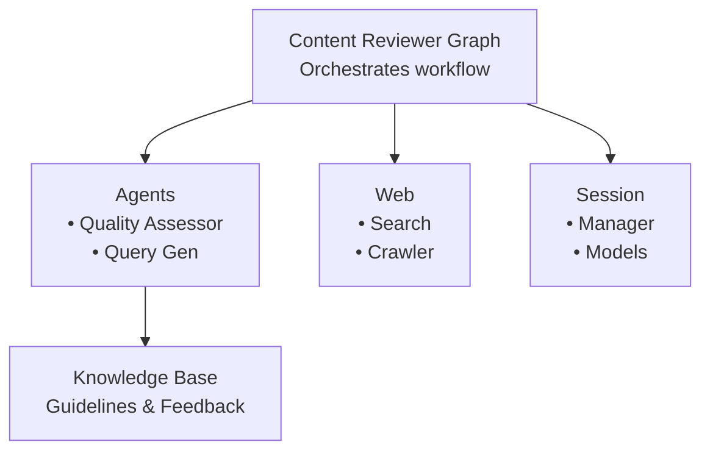

# Content Reviewer Pattern - Index

## Overview

The **Content Reviewer Pattern** is a composite design pattern for implementing quality assessment workflows with session-based retry logic, context enrichment, and optional human-in-the-loop escalation.

## Pattern Summary

**Problem:** Need to assess content quality against standards, allow multiple improvement attempts, and escalate to humans when automated assessment repeatedly fails.

**Solution:** Session-based graph workflow that:
- Enriches assessment with internal knowledge and external web research
- Uses AI agents for quality evaluation across multiple dimensions
- Tracks attempts across non-blocking execution calls
- Supports caller-controlled retry timing
- Provides human escalation points
- Learns from human feedback

**Result:** Flexible, resumable quality assessment system with transparent decision-making and full attempt history.

## Pattern Characteristics

- **Type:** Composite Pattern (combines multiple elementary patterns)
- **Category:** Quality Assurance / Assessment Workflow
- **Complexity:** Intermediate to Advanced
- **Prerequisites:** Session-based graphs, stateless agents, web integration

## Quick Navigation

### Documentation Files

- **[MODULE_STRUCTURE.md](./MODULE_STRUCTURE.md)** - File organization and structure for implementing this pattern
- **[content_reviewer_pattern.md](./content_reviewer_pattern.md)** - Detailed pattern documentation, architecture, and implementation guide

### Building Blocks (Elementary Blueprints)

This pattern is built from the following elementary blueprints:

#### Graph Foundation
- **[graph_session_based.md](../../pydantic/graphs/graph_session_based.md)** - Session-based graph workflow with retry logic
- **[graph_stateful.md](../../pydantic/graphs/graph_stateful.md)** - Stateful graph with shared state

#### Agent Integration
- **[agent_stateless_subagent.md](../../pydantic/agents/agent_stateless_subagent.md)** - Stateless AI agents for quality assessment

#### Context Enrichment
- **[knowledge_vectordb.md](../../libs/knowledge_base/knowledge_vectordb.md)** - Vector database for internal guidelines
- **[web_search.md](../../libs/web/web_search.md)** - Web search for external best practices
- **[web_crawler.md](../../libs/web/web_crawler.md)** - Content extraction from URLs

#### Session Management
- **[session_manager.md](../../libs/session/session_manager.md)** - Session CRUD operations
- **[session_models.md](../../libs/session/session_models.md)** - Session state models

#### Supporting Components
- **[prompt_loader.md](../../libs/utils/prompt_loader.md)** - System prompt management

## When to Use This Pattern

### Use When:
- Content quality must meet specific standards
- Multiple improvement attempts may be needed
- External context improves assessment accuracy
- Retry timing should be caller-controlled
- Human review is acceptable for edge cases
- Full attempt history is valuable for diagnostics
- Process must survive restarts

### Don't Use When:
- Single-pass evaluation is sufficient
- No external context needed
- Real-time response required (no retry tolerance)
- Quality is binary (pass/fail, no scoring)
- Session persistence overhead isn't justified
- Simple validation logic is adequate

## Key Features

### Context Enrichment
- **Internal Knowledge:** Vector search in knowledge base for review guidelines
- **External Research:** Web search and crawling for current best practices
- **Dynamic Queries:** AI-generated search queries optimized for content type

### Quality Assessment
- **Multi-Dimensional Scoring:** Clarity, accuracy, structure, tone, grammar
- **Structured Feedback:** Detailed issues with severity, location, and suggestions
- **Confidence Tracking:** Agent confidence in assessment
- **Requirement Validation:** Reviews against original creation prompt to validate intent fulfillment

### Session-Based Workflow
- **Non-Blocking Retries:** Caller controls timing between attempts
- **Progress Tracking:** Full history of all attempts
- **Recovery Support:** Resume from crashes using session files
- **Dual Completion:** Success via threshold OR exhaustion via max retries
- **Best Attempt Tracking:** Handles non-deterministic quality variations by tracking global maximum score

### Extensibility
- **Human Escalation:** Optional blocking human review
- **Learning Loop:** Save human feedback to knowledge base
- **Custom Scoring:** Adapt evaluation dimensions to content type
- **Multi-Model:** Parallel assessment with multiple AI models

## Example Usage

```python
from src.graphs.content_reviewer import ContentReviewGraph

async def review_content():
    graph = ContentReviewGraph()
    content_versions = {}  # Store best versions

    # Original creation prompt for requirement validation
    creation_prompt = """
    Write a 500-word blog post explaining JWT authentication for beginners.
    Include: what JWTs are, how they work, and a simple use case.
    Tone: Educational but friendly.
    """

    generated_content = "..."  # Generated from the prompt

    # Attempt 1
    result = await graph.review(
        content=generated_content,
        original_prompt=creation_prompt,  # Validate against requirements
        session_id="review_001",
        max_retries=3,
        quality_threshold=0.8
    )

    print(f"Quality Score: {result.quality_score}")

    # Store if this is the best version so far
    if result.is_best_so_far:
        content_versions[result.retry_count] = generated_content

    # Check if retry needed
    if not result.passed and result.can_retry():
        # Revise content based on feedback
        improved_content = apply_suggestions(content, result.review_details)

        # Attempt 2 (same session_id resumes)
        result = await graph.review(
            content=improved_content,
            session_id="review_001"
        )

        if result.is_best_so_far:
            content_versions[result.retry_count] = improved_content

    # Check final outcome
    if result.passed:
        print("✓ Quality standards met")
    elif result.max_retries_reached:
        # Use best version if different from last
        if result.best_attempt_number != result.retry_count:
            best_content = content_versions[result.best_attempt_number]
            print(f"✗ Using best attempt #{result.best_attempt_number} (score: {result.best_quality_score:.2f})")
```

## Architecture Overview

### Workflow Stages

```
1. LoadOrCreateSession     → Initialize/resume session
2. GenerateSearchQueries   → Create optimized KB/web queries
3. GetSavedContext         → Retrieve internal guidelines
4. CollectWebData          → Gather external best practices
5. PerformAIReview         → Quality assessment with context
6. UpdateSession           → Record attempt in history
7. CheckCompletion         → Evaluate completion conditions
8a. SaveSession            → Persist for retry (if can retry)
8b. WipeSession            → Clean up (if complete)
9. PopulateResult          → Build result for caller
```

### Component Layers 



## Pattern Benefits

### Flexibility
- Caller controls retry timing (allows content improvement)
- Configurable thresholds and retry limits
- Optional human escalation
- Extensible scoring dimensions

### Reliability
- Session persistence enables crash recovery
- Full attempt history for debugging
- Graceful degradation (web search failures don't stop workflow)
- Atomic session saves

### Transparency
- Detailed feedback with specific issues
- Structured results with decision flags
- Complete attempt history
- Confidence scoring

### Learning
- Human feedback saved to knowledge base
- Context-aware assessment improves over time
- Historical data for analytics

## Getting Started

1. **Review Prerequisites:** Ensure you understand session-based graphs and stateless agents
2. **Check MODULE_STRUCTURE.md:** Understand file organization
3. **Read content_reviewer_pattern.md:** Detailed implementation guide
4. **Review Building Blocks:** Study referenced elementary blueprints
5. **Adapt to Your Use Case:** Modify pattern for your specific needs

## Core Coding Principles

**IMPORTANT:** Before implementing, ensure code follows [Core Coding Principles](../../INDEX.md#core-coding-principles):
1. **Separation of Concerns** - Single responsibility per module/class/node
2. **KISS Principle** - Simple, direct solutions (no over-engineering)
3. **No Comments** - Self-documenting code (add comments only AFTER testing)

---

## Related Patterns

- **Stateful Graph Pattern:** Foundation for state management
- **Session-Based Graph Pattern:** Foundation for retry logic
- **Agent Orchestrator Pattern:** Coordinating multiple agents
- **Context Enrichment Pattern:** Combining internal and external knowledge

## Version History

- **v1.0** - Initial pattern documentation based on content reviewer implementation
