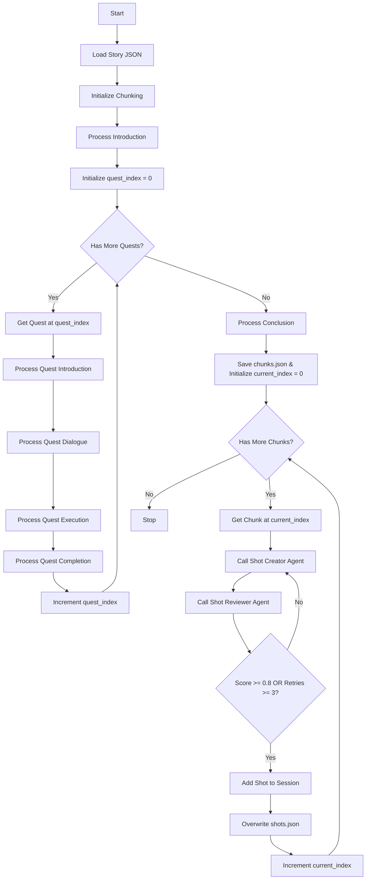

# Shot Creator Agent

## Overview
Shot creator breaks a story JSON file into shots which can be used to create video shots. This agent takes the story JSON file, goes through section by section and generates the shots based on the section. 

## Story Model

The Story model represents the complete narrative structure generated by the Story Creator Agent. It follows a hierarchical structure:

### Story
The top-level container for the entire narrative.

**Fields:**
- `title` (str): The title of the story
- `subject` (str): The subject or theme of the story
- `introduction` (Optional[Narration]): Opening narration to set the scene
- `quests` (list[Quest]): Collection of quests that make up the story
- `conclusion` (Optional[Narration]): Closing narration to wrap up the story

### Quest
Represents an individual quest within the story.

**Fields:**
- `title` (str): The title of the quest
- `sections` (QuestSection): The structured sections of the quest

### QuestSection
Contains the four narrative components of a quest.

**Fields:**
- `introduction` (Optional[Narration]): Narration introducing the quest
- `dialogue` (Optional[DialogueLines]): Dialogue when accepting the quest
- `execution` (Optional[Narration]): Narration during quest execution
- `completion` (Optional[DialogueLines]): Dialogue when completing the quest

### Narration
Represents narrative text content.

**Fields:**
- `text` (str): The narration text
- `word_count` (int): The number of words in the narration

### DialogueLines
Contains multiple dialogue exchanges.

**Fields:**
- `lines` (list[DialogueLine]): Collection of dialogue lines

### DialogueLine
Represents a single line of dialogue.

**Fields:**
- `actor` (str): The character speaking the line
- `line` (str): The dialogue text

### Story Structure Flow

```
Story
├── introduction (Narration)
├── quests[]
│   └── Quest
│       ├── title
│       └── sections
│           ├── introduction (Narration)
│           ├── dialogue (DialogueLines)
│           │   └── lines[]
│           │       └── DialogueLine
│           │           ├── actor
│           │           └── line
│           ├── execution (Narration)
│           └── completion (DialogueLines)
│               └── lines[]
│                   └── DialogueLine
│                       ├── actor
│                       └── line
└── conclusion (Narration)
```

## The Agent Workflow
The Shot Creator uses a three-phase approach: first chunking the entire story into processable chunks, then converting each chunk into a shot with AI-determined TTS and cinematography parameters, and finally reviewing each shot for WoW authenticity and quality.



## State Management
The workflow maintains state across nodes using a session object that tracks chunking progress and shot generation.

### ShotCreatorSession
- It is a dataclass
- Has the following properties:
    - `subject` (str): The story subject (for file paths)
    - `story` (Story): The loaded Story object
    - `chunks` (list[Chunk]): All text chunks to process
    - `quest_index` (int): Current quest being processed during chunking phase
    - `current_quest` (Quest | None): Current quest object being processed
    - `current_index` (int): Current chunk being processed during shot creation phase
    - `shots` (list[Shot]): All generated shots
    - `current_retry_count` (int): Number of retries for current shot review (0-3)
    - `current_review_comments` (str | None): Review feedback for shot improvement
- This class is passed to each node as described in the guide

### Chunk
- It is a dataclass
- Has the following properties:
    - `text` (str): The text content for this chunk
    - `actor` (str): The narrator/actor name ("aaryan" for narrations, first name for dialogues)
    - `chunk_type` (str): Either "narration" or "dialogue"
    - `reference` (str): Human-readable story location (e.g., "Introduction", "Quest 1 - Dialogue")

### Shot
- It is a Pydantic BaseModel
- Has the following properties:
    - `shot_number` (int): Sequential shot number (1, 2, 3, ...)
    - `actor` (str): The voice narrator for the shot
    - `temperature` (float): Emotional intensity of the speech (0.1 - 1.0)
    - `language` (str): Language code (always "en" for English)
    - `exaggeration` (float): Dramaticness/intensity level (0.1 - 1.0)
    - `cfg_weight` (float): Speech speed control (0.1 - 1.0)
    - `text` (str): The actual narration or dialogue text content
    - `reference` (str): Story location reference (inherited from Chunk)
    - `camera_zoom` (CameraZoom): Camera framing - wide, medium, or close
    - `camera_angle` (CameraAngle): Camera position - front, front_left, left, back_left, back, back_right, right, front_right
    - `player_actions` (str): What the player should do to capture the shot (1-2 sentences max)
    - `backdrop` (str): Scene and environment description (1-2 sentences max)
    - `duration_seconds` (float): Shot duration in seconds

### Shot Duration Guidelines
Shots are created based on TTS speech timing and player action complexity:
- **Standard TTS speed**: 150 words per minute = 2.5 words per second
- **Base calculation**: `duration = word_count / 2.5`
- **Adjustments**:
    - Add 2-4 seconds for complex player actions (movement + positioning + emote)
    - Add 1-2 seconds for simple player actions (single emote or position)
    - Add 3-5 seconds for establishing shots with wide camera zoom
    - Subtract 1-2 seconds for urgent dialogue with high cfg_weight
- **Duration Ranges**:
    - Short urgent dialogue: 5-10 seconds
    - Standard dialogue: 10-15 seconds
    - Standard narration: 15-20 seconds
    - Establishing shots: 20-25 seconds
    - Maximum: 30 seconds

## The Nodes

### Phase 1: Story Chunking

### LoadStory
- Reads the story from `output/{subject}/story.json`
- The `subject` is passed during graph invocation
- Parses the JSON into a `Story` object
- Stores `subject` and `story` in `ShotCreatorSession`
- If the file does not exist, End the workflow with proper message
- If the file exists, transfer control to `InitializeChunking`

### InitializeChunking
- Initializes `ShotCreatorSession.chunks` as empty list
- Initializes `ShotCreatorSession.shots` as empty list
- Clears `output/{subject}/shots.json` (delete if exists)
- Transfer control to `ProcessIntroduction`

### ProcessIntroduction
- Checks if `story.introduction` exists
- If exists:
    - Invokes **Chunker Agent** with:
        - `text`: `story.introduction.text`
        - `chunk_type`: "narration"
        - `actor`: "aaryan"
        - `reference`: "Introduction"
    - Receives `list[Chunk]` from agent
    - Appends all chunks to `ShotCreatorSession.chunks`
- Transfer control to `InitializeQuestIndex`

### InitializeQuestIndex
- Sets `ShotCreatorSession.quest_index = 0`
- Transfer control to `CheckHasMoreQuests`

### CheckHasMoreQuests
- Checks if `quest_index < len(story.quests)`
- If yes, transfer control to `GetNextQuest`
- If no, transfer control to `ProcessConclusion`

### GetNextQuest
- Retrieves quest at `story.quests[quest_index]`
- Stores quest in `ShotCreatorSession.current_quest`
- Transfer control to `ProcessQuestIntroduction`

### ProcessQuestIntroduction
- Gets `current_quest` from `ShotCreatorSession`
- Checks if `current_quest.sections.introduction` exists
- If exists:
    - Invokes **Chunker Agent** with:
        - `text`: `current_quest.sections.introduction.text`
        - `chunk_type`: "narration"
        - `actor`: "aaryan"
        - `reference`: "Quest {quest_index + 1} - Introduction"
    - Receives `list[Chunk]` from agent
    - Appends all chunks to `ShotCreatorSession.chunks`
- Transfer control to `ProcessQuestDialogue`

### ProcessQuestDialogue
- Gets `current_quest` from `ShotCreatorSession`
- Checks if `current_quest.sections.dialogue` exists
- If exists:
    - For each `DialogueLine` in `current_quest.sections.dialogue.lines`:
        - Extract first name from `line.actor` (remove titles)
        - Invokes **Chunker Agent** with:
            - `text`: `line.line`
            - `chunk_type`: "dialogue"
            - `actor`: extracted first name
            - `reference`: "Quest {quest_index + 1} - Dialogue"
        - Receives `list[Chunk]` from agent (should be 1 chunk for dialogues)
        - Appends all chunks to `ShotCreatorSession.chunks`
- Transfer control to `ProcessQuestExecution`

### ProcessQuestExecution
- Gets `current_quest` from `ShotCreatorSession`
- Checks if `current_quest.sections.execution` exists
- If exists:
    - Invokes **Chunker Agent** with:
        - `text`: `current_quest.sections.execution.text`
        - `chunk_type`: "narration"
        - `actor`: "aaryan"
        - `reference`: "Quest {quest_index + 1} - Execution"
    - Receives `list[Chunk]` from agent
    - Appends all chunks to `ShotCreatorSession.chunks`
- Transfer control to `ProcessQuestCompletion`

### ProcessQuestCompletion
- Gets `current_quest` from `ShotCreatorSession`
- Checks if `current_quest.sections.completion` exists
- If exists:
    - For each `DialogueLine` in `current_quest.sections.completion.lines`:
        - Extract first name from `line.actor` (remove titles)
        - Invokes **Chunker Agent** with:
            - `text`: `line.line`
            - `chunk_type`: "dialogue"
            - `actor`: extracted first name
            - `reference`: "Quest {quest_index + 1} - Completion"
        - Receives `list[Chunk]` from agent (should be 1 chunk for dialogues)
        - Appends all chunks to `ShotCreatorSession.chunks`
- Transfer control to `IncrementQuestIndex`

### IncrementQuestIndex
- Increments `ShotCreatorSession.quest_index` by 1
- Transfer control to `CheckHasMoreQuests`

### ProcessConclusion
- Checks if `story.conclusion` exists
- If exists:
    - Invokes **Chunker Agent** with:
        - `text`: `story.conclusion.text`
        - `chunk_type`: "narration"
        - `actor`: "aaryan"
        - `reference`: "Conclusion"
    - Receives `list[Chunk]` from agent
    - Appends all chunks to `ShotCreatorSession.chunks`
- Transfer control to `InitializeShotIndex`

### Phase 2: Shot Creation

### InitializeShotIndex
- Sets `ShotCreatorSession.current_index = 0`
- Saves all chunks to `output/{subject}/chunks.json` for faster re-generation
- Prints confirmation message
- Transfer control to `CheckHasMoreChunks`

### CheckHasMoreChunks
- Checks if `current_index < len(chunks)`
- If yes, transfer control to `GetChunk`
- If no, transfer control to End

### GetChunk
- Retrieves chunk at `chunks[current_index]`
- Transfer control to `CreateShot` with the chunk

### CreateShot
- Invokes the **Shot Creator Agent** with the chunk
- If `current_review_comments` exists, appends review feedback to text
- The agent receives:
    - `text` from chunk (with optional review feedback appended)
    - `actor` from chunk
    - `chunk_type` from chunk
    - `reference` from chunk
- The agent analyzes the text and returns a `Shot` object with:
    - `actor` (copied from chunk)
    - `temperature` (AI-determined based on emotional tone)
    - `language` (always "en")
    - `exaggeration` (AI-determined based on dramaticness)
    - `cfg_weight` (AI-determined based on pacing)
    - `text` (copied from chunk)
    - `reference` (copied from chunk)
    - `camera_zoom` (AI-determined: wide for establishing, medium for standard, close for emotional)
    - `camera_angle` (AI-determined: front, front_left, left, back_left, back, back_right, right, front_right)
    - `player_actions` (AI-determined concise instructions, max 1-2 sentences)
    - `backdrop` (AI-determined succinct description, max 1-2 sentences)
    - `duration_seconds` (AI-calculated based on word count and complexity)
- Transfer control to `ReviewShot`

### ReviewShot
- Invokes the **Shot Reviewer Agent** to validate shot authenticity and quality
- Prints review progress in cyan: `[*] Reviewing shot {number}...`
- The agent receives the complete shot and validates:
    - WoW lore and location authenticity
    - Camera angle feasibility in WoW
    - Player actions feasibility (no NPC control)
    - Valid WoW emotes
    - WoW-appropriate terminology
    - Reasonable duration for text length
    - Player actions conciseness (1-2 sentences max)
    - Backdrop conciseness (1-2 sentences max)
    - Consistency with previous shots in same location
- Returns Review object with `need_improvement` (bool), `score` (float), and `review_comments` (str)
- Prints review score (green if >= 0.8, yellow otherwise): `[+] Review score: {score}/1.0`
- **If score < 0.8 AND retry_count < 3**:
    - Increments `current_retry_count`
    - Sets `current_review_comments` with feedback
    - Prints retry message in yellow: `[!] Retry {count}/3: {feedback}`
    - Transfer control back to `CreateShot` (with feedback)
- **If score >= 0.8 OR retry_count >= 3**:
    - If max retries reached, prints warning: `[!] Max retries reached, proceeding with score {score}`
    - Resets `current_retry_count` to 0
    - Clears `current_review_comments`
    - Transfer control to `StoreShot`

### StoreShot
- Calculates shot_number as `len(shots) + 1`
- Sets the shot_number on the Shot object
- Appends the generated Shot to `ShotCreatorSession.shots`
- Transfer control to `WriteShotsFile`

### WriteShotsFile
- Overwrites `output/{subject}/shots.json` with all shots from session
- Writes the complete `ShotCreatorSession.shots` list as JSON
- This ensures we always have the full list and don't lose data
- Transfer control to `IncrementChunkIndex`

### IncrementChunkIndex
- Increments `ShotCreatorSession.current_index` by 1
- Transfer control to `CheckHasMoreChunks`

## The AI Agents

### Chunker Agent
- AI agent that breaks the Story into meaningful chunks
- This agent does not exist, we have to create this agent
- **Input**: Complete Story object
- **Output**: list[Chunk]
- **Responsibilities**:
    - For narrations: Break text into 15-20 second meaningful segments that don't cut off abruptly
    - For dialogues: Create one chunk per DialogueLine
    - Extract first names from actor names (remove titles like Magistrix, Ranger, Arch Mage, Huntress, Priestess)
    - Set appropriate chunk_type ("narration" or "dialogue")
    - Generate reference strings for traceability
- The system prompt should follow the "GPT Identity-Purpose Template"
- The prompt should explicitly mention chunk size targets (37-50 words, 15-20 seconds at 150 words/min)
- The prompt should mention title removal rules and examples

### Shot Creator Agent
- AI agent that determines TTS parameters and cinematography settings for a chunk
- **Input**:
    - `text` (str): The chunk text (may include review feedback)
    - `actor` (str): The narrator/actor name
    - `chunk_type` (str): "narration" or "dialogue"
    - `reference` (str): Story location reference
- **Output**: Shot object
- **Responsibilities**:
    - Analyze text emotional tone → determine `temperature` (0.1-1.0)
    - Analyze text dramaticness → determine `exaggeration` (0.1-1.0)
    - Analyze text pacing needs → determine `cfg_weight` (0.1-1.0)
    - Determine appropriate `camera_zoom` (wide/medium/close)
    - Determine appropriate `camera_angle` (front, front_left, left, back_left, back, back_right, right, front_right)
    - Create concise `player_actions` (1-2 sentences max)
    - Create succinct `backdrop` description (1-2 sentences max)
    - Calculate `duration_seconds` based on word count and complexity
    - Assemble complete Shot object with all fields
- The system prompt follows the "GPT Identity-Purpose Template"
- The prompt explains what each parameter means and how to determine appropriate values
- The prompt differentiates handling between narration vs dialogue chunk types
- The prompt emphasizes conciseness for player_actions and backdrop (max 1-2 sentences)
- The prompt includes duration calculation formula and adjustment guidelines

### Shot Reviewer Agent
- AI agent that validates shot authenticity and quality for WoW video capture
- Stateful agent with session_id for context memory
- Uses MCP servers (web_search, web_crawler) for WoW lore verification
- **Input**: Complete Shot object with all fields
- **Output**: Review object (need_improvement, score, review_comments)
- **Responsibilities**:
    - Validate WoW lore and location authenticity (backdrop matches reference)
    - Verify camera angle is achievable in WoW's camera system
    - Ensure player actions only describe player character (no NPC control)
    - Check all emotes are valid WoW emotes
    - Verify WoW-appropriate terminology (no modern/sci-fi terms)
    - Validate duration is reasonable for text length and actions
    - Enforce conciseness: player_actions max 1-2 sentences
    - Enforce conciseness: backdrop max 1-2 sentences
    - Check consistency with previous shots in same location
- **Scoring Guide**:
    - 0.9-1.0: Excellent, all criteria met
    - 0.7-0.8: Good with minor issues
    - 0.5-0.6: Needs improvement
    - < 0.5: Serious issues
- The system prompt follows the "GPT Identity-Purpose Template"
- The prompt includes specific validation criteria and examples
- The prompt provides guidance on writing actionable review comments

## Graph Entry Point
Graph entry point should be set up in two steps:
1. Define the Graph object based on the section "## Invoking A Graph" of the Pydantic Graph blueprint
2. Create a CLI or web interface entry point to invoke the graph
3. The `subject` should be passed to the graph and set to the first node

## Error Handling
- For any kind of error, right now keep it KISS. Later we will put some graceful system.
- If story.json doesn't exist, end gracefully with error message
- If shots.json write fails, log error but continue (will retry on next write)


