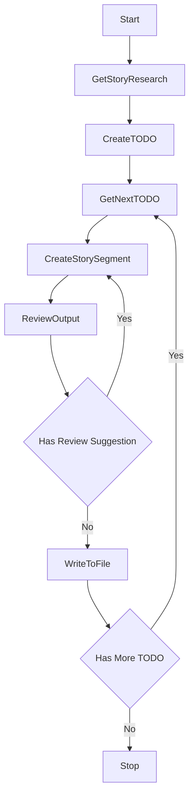

# Story Creator Agent

## Overview
The Story Creator Agent is an autonomous agent that has a Pydantic graph based implementation. The agent takes this approach because it has a complex workflow.

## The Agent Workflow
The overall workflow looks as follows

## State Management
First we will talk about state management. This is important, because the information will be shared across the nodes (states). We will define an class called StorySession

### StorySession
- It is a dataclass
- Has the following properties
    - todo_list: list[Todo]
    - subject: str
    - player: str
    - current_todo_index: int
- This class is passed on to each node as described in the guide

### Todo 
- It is a dataclass
- Has the following properties
    - item: StorySegment
    - review_comments: str | None (review comment for the Story Creator)
    - status: literal('pending', 'in progress', 'done')
    - retry_count: int

### StorySegment
- It is a dataclass
- Has the following properties
    - type: literal('introduction', 'quest', 'conclusion')
    - sub_type: literal('quest_introduction, 'quest_dialogue', 'quest_execution', 'quest_conclusion') | None
    - description: str (max 15 word description of this segment, for quest sub-types, the description IS the quest title)
    - prompt: str (prompt to LLM for how to create the segment)
    - output: Narration | DialogueLines (output generated by the LLM)

## The Nodes
### InitStoryCreation
- Initializes the graph by initializing the session variables and setting the values for `subject` and `player`
- Sends the control to `GetStoryResearch` node

### GetStoryResearch
- Reads the research from `output\{subject}\research.md`
- The `subject` is passed to the node during graph invoking
- This node stores the `subject` to the `StorySession`
- If the file does not exists then End the workflow with proper message
- If the file exists read the research content as a string and send it to `CreateTODO` as constructor argument

### CreateTODO
- Invokes the TODO creator AI agent to create a list of TODO 
- The prompt for the agent is
    ```ascii
    please create a TODO list from the below story research document so that it can be passed to a story creator agent, one TODO at a time, for generating the story:
    
    {research_content}
    ```
- Once the TODO is created it sets the TODO in the `StorySession` and transfer control to `GetNextTODO` node

### GetNextTODO
- if `current_todo_index is None` initialize it to 0
- Otherwise increment it by 1
- If `current_todo_index < len(todo_list)` then returns `CreateStorySegment`
- Otherwise returns End

### CreateStorySegment
- Access the current TODO
- Based on the segment it invokes the proper agents
    - For "introduction", "quest_introduction", "quest_execution", and "conclusion" it uses the "Narrator" agent
    - For "quest_dialogue", "quest_conclusion" it uses the "DialogCreator" agent.
    - The `prompt` from the `StorySegment` is sent to the agent for generating the content
    - If it is a regeneration request because the content needs improvement then `review_comment` is added at the bottom of the prompt from the `todo`
- Once the content is generated it saves it in the `StorySegment` and then transfer the control to `ReviewOutput` node

### ReviewOutput
- Receives the generated content
- Generates a prompt for the AI agent to review the content. The prompt should be
    ```ascii
    review the below content and score the content between 0 to 1, then provide a review comment if needed:
    {generated_output}
    ```
- Sends it to the AI reviewer with output_type `Review` a dataclass for the reviewer to respond
- Get the response back
- If the `need_improvement` is true then the review_comments are set to the todo, and the control is sent back to `CreateStorySegment`
- If the `need_improvement` is false or `score > 0.9` then the control is sent to `WriteToFile`
- Retry the review <-> segment generation 10 times. If after 10 times the segment does not have score higher or equal to 0.9 then transfer the control to `WriteToFile` however print a warning.

### Review
- It is a dataclass
- It is sent to the AI reviewer for output_type
- It has the following properties:
    - need_improvement: bool
    - score: float
    - review_comments: str

### WriteToFile
- Writes the story segment to the story file
- The story file is stored in `output\{subject}\story.json`
- `subject` should already be in the `StorySession` at this point
- It follows the below sequence
    1. If the `story.json` file exists then reads the file and loads the `Story` object
    2. If the `story.json` file does not exist it creates an empty `Story` object
    2. Creates proper segment in the `Story` object.
    3. Writes the updated content back to the `story.json` file
- The `StorySegment` to `Story` mapping
    - If `StorySegment.type == 'introduction'` then `Story.introduction = StorySegment.output`
    - If `StorySegment.type == 'conclusion'` then `Story.conclusion = StorySegment.output`
    - If `StorySegment.type == 'quest' and StorySegment.sub_type == 'quest_introduction` then:
        - Create a `Quest` object
        - Assign `StorySegment.description` to `title` 
        - Initialize the `sections`
        - Set `QuestSection.introduction = StorySegment.output`
    - If `StorySegment.type == 'quest' and StorySegment.sub_type == 'quest_dialogue` then:
        - Search `Quest` from the `Story.quests` with `title == StorySegment.description`
        - If not found raise except, because at this point we should have a quest with that title
        - If found then set `QuestSection.dialogue = StorySegment.output`
    - If `StorySegment.type == 'quest' and StorySegment.sub_type == 'quest_execution` then:
        - Search `Quest` from the `Story.quests` with `title == StorySegment.description`
        - If not found raise except, because at this point we should have a quest with that title
        - If found then set `QuestSection.execution = StorySegment.output`
    - If `StorySegment.type == 'quest' and StorySegment.sub_type == 'quest_conclusion` then:
        - Search `Quest` from the `Story.quests` with `title == StorySegment.description`
        - If not found raise except, because at this point we should have a quest with that title
        - If found then set `QuestSection.completion = StorySegment.output`
- The story file is a json file
- The story structure is mentioned in `story_models.py` file. This is the structure written into the story file
- Once it does the above persisting operation it sends the control back to `GetNextTODO`
- Note: the `Story` object is not persisted in session, it is loaded from the json and stored back in the json. This approach is taken to reduce the long term memory requirement

## The AI Agents
### TODO Creator
- AI agent that reads the research and generates a TODO
- This agent does not exist, we have to create this agent
- This agent returns a list of TODOs that are stored in the `StorySession`
- The system prompt for this agent should follow the "GPT Identity-Purpose Template". The prompt should explicitly mention that it is creating a TODO list from the research. Its output should be a `list[Todo]` object.
- The system prompt should also mention how to break the research into the list of TODO so that all the sections of the story can be generated from the list of TODO. The TODO should cover all the sections of the story, "Introduction", "Quests", "Conclusion"

### Narrator
- AI agent that creates a narration
- The agent already exists in `\src\agents\narrator_agent`
- We should re-use the same agent

### DialogCreator
- AI agent that creates a dialogue
- The agent already exists in `\src\agents\dialog_creator_agent`
- We should re-use the same agent

### Reviewer
- AI agent that reviews the created content
- This agent exists, however the prompt might need to be changed
- The agent is located in `\src\agents\reviewer_agent`

## Graph Entry Point
Graph entry point should be set up in two steps
1. Define the Graph object based on the section "## Invoking A Graph" of `PDs\pydantic_graph_guide`
2. Update the `create_story.py` to invoke the graph object created above
3. The `subject` and the `player` should be set to the `Graph` object and in tern set to the `InitStoryCreation`.

## Error Handling
- For any kind of error, right now keep it KISS. Later we will put some graceful system.
